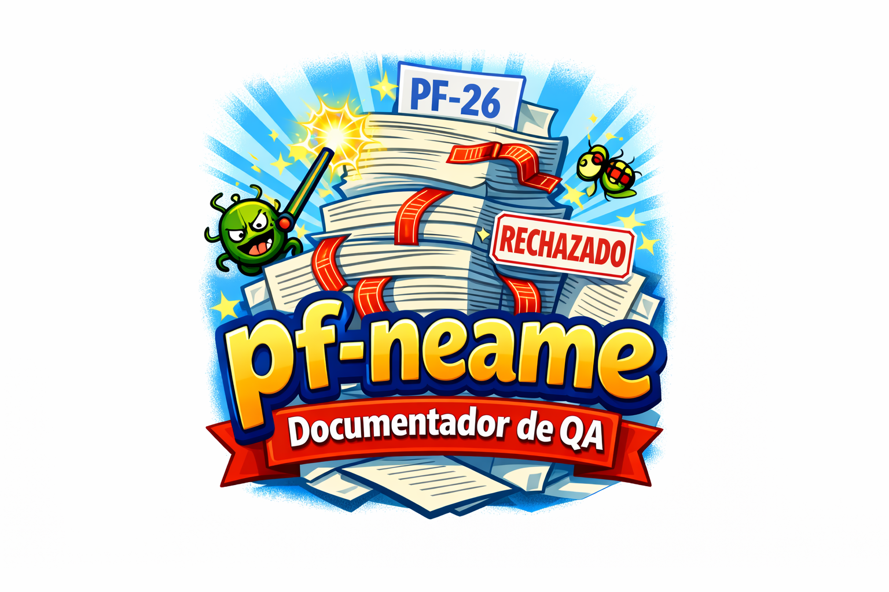

# pf-neame: ¡El Generador de "Documentación" para QA!



Te han devuelto un requerimiento del hive por los p&%@s documentos PF-26 y PF-30.

¡Bienvenidos al infierno burocrático! Esta "utilidad" CLI es mini-servicio para el equipo de Desarrolllo y QA, diseñado para que se "pf-nemee" (léase: "fuck me pf-xx document") con archivos .dll y .exe. Básicamente, es un "pf-neame este", porque ¿quién no ama diligenciar documentos cuando podría estar probando bugs reales o solucionando la deuda técnica?

## ¿Qué hace esta maravilla?
Toma la información de tus preciosos archivos (comentarios, fileversion y demás) y automáticamente diligencia los sagrados documentos PF-26 y PF-30. ¡Porque nada dice "productividad" como automatizar el papeleo que nadie quiere hacer!

## Instalación
Clona este repo, instala Go (si no lo tienes, ¡qué pena!), y corre:
```
go build -o pf-neame main.go
```

## Uso
Ejecuta el comando mágico:
```
./pf-neame <ruta-al-archivo.dll-o-exe>
```
Y voilà! Tus documentos PF-26 y PF-30 se llenarán solos. ¡O no! (Spoiler: probablemente sí, pero no los vamos a subir tambien!!).

## Ejemplos
- `./pf-neame miApp.exe` → Genera PF-26 con versión 1.0.0 y comentarios "Esta app es un chiste".
- `./pf-neame --help` → Muestra ayuda, porque incluso los chistes necesitan instrucciones.

## Contribuciones
¿Quieres agregar más herramientas? ¡Pull requests welcome! Pero recuerda: esto es un chiste funcional, no lo tomes tan en serio. Si encuentras bugs, es porque el QA no lo probó bien. 😈

## Nota
Este proyecto es una broma interna para el equipo de QA y Desarrollo. No lo uses en producción, a menos que quieras que te miren raro en las reuniones.

Ningun QA fue lastimado en la creación de este software. ¡Pf-neame con responsabilidad!

## Licencia
MIT, porque incluso los chistes necesitan licencias. ¡Diviértete pf-nemeando!
